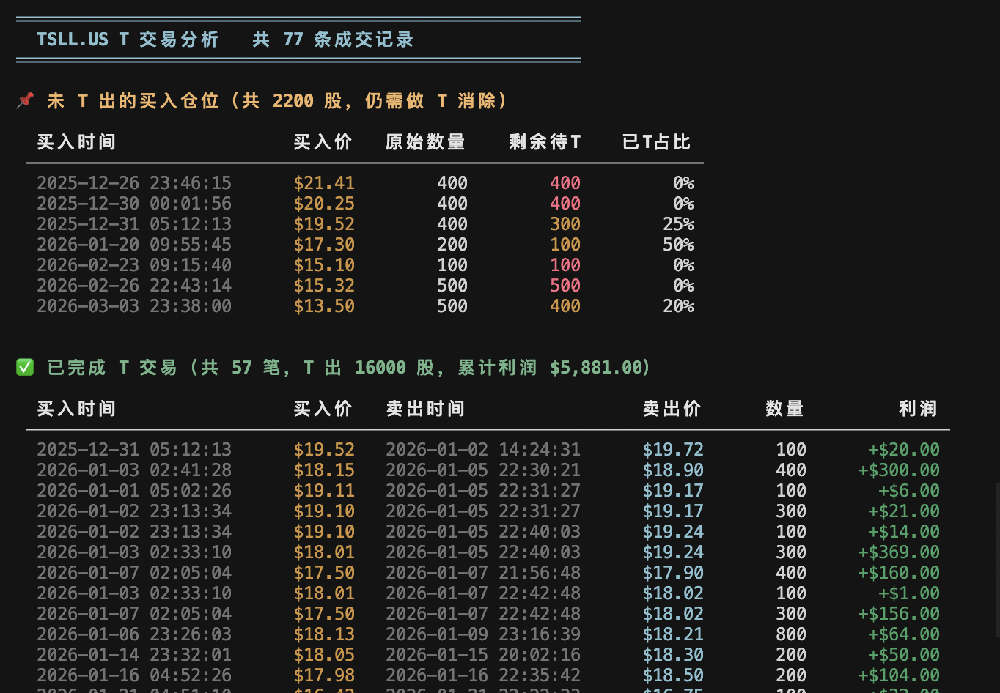

# 期权信号抓取器 + 自动交易系统 v2.6.15

使用 Playwright 实时监控 Whop 页面，解析期权交易信号,并通过长桥证券 API 自动执行交易，包含完整的持仓管理和风险控制系统。

## ⚠️ 注意
本项目对于指令的解析完全基于文本正则匹配和历史消息关联，没有使用任何大模型，因此对于新的自然语言描述格式，可能会存在不识别的情况；

## 效果展示
### 1. 程序启动


### 2. 更新配置和账户信息


### 3. 监听消息


### 4. 分析股票做T情况


## 安装依赖

```bash
# 安装 Python 依赖
pip3 install -r requirements.txt

# 安装 Playwright 浏览器
python3 -m playwright install chromium
```

## 配置

> 💡 **统一配置管理**：所有配置项都在 `.env` 文件中设置，无需修改代码。

### 配置步骤

1. 复制配置模板：
```bash
cp .env.example .env
```

2. 编辑 `.env` 文件，填入你的凭据。


## 长桥OpenAPI 配置

[https://open.longbridge.com/zh-CN/](https://open.longbridge.com/zh-CN/)


登录后，就可以看到自己的AppKey，AppSecret，AccessToken
> 注意：如果期望通过API完成下单操作，需要购买对应的OpenAPI行情 


```bash
# 长桥账户相关配置
# 账户模式
LONGPORT_MODE=paper            # paper=模拟账户, real=真实账户
# API 凭据（模拟账户）
LONGPORT_PAPER_APP_KEY=xxxx
LONGPORT_PAPER_APP_SECRET=xxxx
LONGPORT_PAPER_ACCESS_TOKEN=xxxx
# API 凭据（真实账户）
LONGPORT_REAL_APP_KEY=xxxx
LONGPORT_REAL_APP_SECRET=xxxx
LONGPORT_REAL_ACCESS_TOKEN=xxxx
# 交易模式
LONGPORT_AUTO_TRADE=true      # 是否启用自动交易
LONGPORT_DRY_RUN=false          # 是否启用模拟模式（不实际下单）

```

```bash
# 与TG通信配置，目前我只是跑通了链路，自己并没有使用

# 是否启用 Telegram 确认：开启后，解析到交易指令会发到 Telegram Bot，带「确认/取消」按钮，
# 只有在 App 里点击确认后才会调用 longport 下单
# 默认值: false
TELEGRAM_ENABLED=false

# Telegram Bot Token（从 @BotFather 创建 Bot 后获得）
TELEGRAM_BOT_TOKEN=xxxx:xxxx

# 接收消息的 Chat ID（与 Bot 对话后，可从 getUpdates 或 @userinfobot 等获取）
TELEGRAM_CHAT_ID=xxxx
```

## 抓取Cookie
```bash
# 需要抓取网页的cookie，获取登录态，后续可直接监听，不用登录
# 执行后会自动打开网页，登录完毕在命令行回车即可
# Cookie 默认保存在 .auth/whop_cookie.json
python3 whop/whop_login.py
```

## 启动系统
```bash
python3 main.py
```

## 开发者指南

### 导出页面消息（自动滚动抓取）

全屏打开浏览器，自动滚动消息区以加载历史，抓取后按 domID 去重导出为 JSON。

```bash
python3 scripts/scraper/export_page_message.py [--type stock|option] [--output PATH] [--url URL]
```

| 参数 | 说明 | 默认值 |
|------|------|--------|
| `--type` | 页面类型：`stock` 正股、`option` 期权 | `stock` |
| `--output` | 消息导出路径 | `tmp/<type>/origin_message.json` |
| `--url` | 目标页面 URL；不传则从 `.env` 的 `PAGES` 中按 `--type` 取首个 | - |

示例：
```bash
# 正股页消息导出到默认路径 tmp/stock/origin_message.json
python3 scripts/scraper/export_page_message.py

# 期权页消息导出到指定路径
python3 scripts/scraper/export_page_message.py --type option --output tmp/option/origin_message.json

# 指定 URL（可直接复制 .env 中 PAGES 的 url）
python3 scripts/scraper/export_page_message.py --type stock --url "https://whop.com/joined/stock-and-option/-GiWyN1ZTuUjwlG/app/"
python3 scripts/scraper/export_page_message.py --type option --url "https://whop.com/joined/stock-and-option/-gZyq1MzOZAWO98/app/"
```

### 导出页面 HTML

打开目标页面，将当前 DOM 的 HTML 导出到本地文件（用于分析页面结构或调试滚动逻辑）。

```bash
python3 scripts/scraper/export_page_html.py [--type stock|option] [--output PATH] [--url URL]
```

| 参数 | 说明 | 默认值 |
|------|------|--------|
| `--type` | 页面类型：`stock` 正股、`option` 期权 | `stock` |
| `--output` | HTML 导出路径 | `tmp/<type>/page_html.html` |
| `--url` | 目标页面 URL；不传则从 `.env` 的 `PAGES` 中按 `--type` 取首个 | - |

示例：
```bash
# 正股页 HTML 导出到默认路径 tmp/stock/page_html.html
python3 scripts/scraper/export_page_html.py

# 期权页 HTML 导出到指定路径
python3 scripts/scraper/export_page_html.py --type option --output tmp/option/page_html.html

# 指定 URL（可直接复制 .env 中 PAGES 的 url）
python3 scripts/scraper/export_page_html.py --type stock --url "https://whop.com/joined/stock-and-option/-GiWyN1ZTuUjwlG/app/"
python3 scripts/scraper/export_page_html.py --type option --url "https://whop.com/joined/stock-and-option/-gZyq1MzOZAWO98/app/"
```

### 按股票过滤消息

从原始消息 JSON 中筛出**仅在本条 content 中提及指定股票**的消息，导出到 `tmp/stock/origin_<TICKER>_message.json`（不按 history 匹配）。

```bash
python3 scripts/parser/filter_target_stock.py TICKER [--input PATH] [--output PATH]
```

| 参数 | 说明 | 默认值 |
|------|------|--------|
| `TICKER` | 股票代码（必填） | - |
| `--input` | 原始消息 JSON 路径 | `tmp/stock/origin_message.json` |
| `--output` | 导出路径 | `tmp/stock/origin_<TICKER>_message.json` |

示例：
```bash
# 过滤出 content 中提到 TSLL 的消息，导出到 tmp/stock/origin_TSLL_message.json
python3 scripts/parser/filter_target_stock.py tsll

# 指定输入与输出路径
python3 scripts/parser/filter_target_stock.py HIMS --input data/stock_origin_message.json --output tmp/stock/origin_HIMS_message.json
```

### 股票做T情况分析

分析单只股票的买卖记录，识别哪些买入成本尚未通过当日 T 交易消除；结果以表格形式输出到终端（未 T 出的买入仓位、已完成 T 交易、超额卖出、汇总）。

**数据来源**：不指定 `--file` 时从长桥 API 拉取该股票最近 N 天已成交订单（含当日已成交）；指定 `--file` 时从本地 JSON 读取。

**匹配策略**：卖单在「买入价 < 卖价」的批次中按**买入价从高到低**匹配，优先消掉高成本仓位。

```bash
python3 scripts/analysis/t_trade_analysis.py [TICKER] [--file PATH] [--days N]
```

| 参数 | 说明 | 默认值 |
|------|------|--------|
| `TICKER` | 股票代码（如 TSLL，不含 .US） | `TSLL` |
| `--file` | 交易记录 JSON 路径 | 不指定则走长桥 API |
| `--days` | API 拉取最近天数（仅在不使用 `--file` 时生效） | `90` |

示例：
```bash
# 从长桥 API 拉取 TSLL 最近 90 天（含当日）并分析
python3 scripts/analysis/t_trade_analysis.py TSLL

# 拉取最近 60 天
python3 scripts/analysis/t_trade_analysis.py TSLL --days 60

# 从本地文件分析
python3 scripts/analysis/t_trade_analysis.py TSLL --file data/stock_trade_records.json
```

## 文档索引

- [股票页监控与关注列表](docs/stock_monitoring.md) — 正股页面监控、关注股票列表、消息抓取脚本

### 配置分类

#### Whop 平台配置
```env
# 可选：页面 URL
# TARGET_URL=https://whop.com/joined/stock-and-option/-9vfxZgBNgXykNt/app/
# LOGIN_URL=https://whop.com/login/

# 可选：浏览器设置
HEADLESS=false          # 是否无头模式运行
SLOW_MO=0               # 浏览器操作延迟（毫秒）

# 可选：监控设置
POLL_INTERVAL=2.0       # 轮询间隔（秒）
```

#### 长桥证券配置
```env
# 必填：账户模式
LONGPORT_MODE=paper     # paper=模拟账户, real=真实账户

# 必填：API 凭据（根据账户模式填写对应的配置）
LONGPORT_PAPER_APP_KEY=your_paper_app_key
LONGPORT_PAPER_APP_SECRET=your_paper_app_secret
LONGPORT_PAPER_ACCESS_TOKEN=your_paper_access_token

# 可选：交易模式
LONGPORT_AUTO_TRADE=false   # 是否启用自动交易
LONGPORT_DRY_RUN=true       # 是否启用模拟模式（不实际下单）
```

## 使用方法

### 仅监控模式

如果只想监控信号而不交易，设置：

```bash
# 在 .env 中
LONGPORT_AUTO_TRADE=false
```

然后运行：

```bash
python3 main.py
```

## 支持的指令格式

### 1. 开仓指令

| 示例 | 解析结果 |
|------|---------|
| `INTC - $48 CALLS 本周 $1.2` | 股票: INTC, 行权价: 48, 类型: CALL, 价格: 1.2 |
| `AAPL $150 PUTS 1/31 $2.5` | 股票: AAPL, 行权价: 150, 类型: PUT, 到期: 1/31, 价格: 2.5 |
| `TSLA - 250 CALL $3.0 小仓位` | 股票: TSLA, 行权价: 250, 类型: CALL, 价格: 3.0, 仓位: 小仓位 |

**⚠️ 期权过期校验**：系统会自动检查期权到期日，如果期权已过期（到期日早于当前日期），将自动拦截并跳过该指令，不会执行下单操作。

### 2. 止损指令

| 示例 | 解析结果 |
|------|---------|
| `止损 0.95` | 止损价: 0.95 |
| `止损提高到1.5` | 调整止损至: 1.5 |

### 3. 止盈/出货指令

| 示例 | 解析结果 |
|------|---------|
| `1.75出三分之一` | 价格: 1.75, 比例: 1/3 |
| `1.65附近出剩下三分之二` | 价格: 1.65, 比例: 2/3 |
| `2.0 出一半` | 价格: 2.0, 比例: 1/2 |

## 输出格式

解析后的指令保存在 `output/signals.json`，格式如下：

```json
[
  {
    "timestamp": "2026-01-28T10:00:00",
    "raw_message": "INTC - $48 CALLS 本周 $1.2",
    "instruction_type": "OPEN",
    "ticker": "INTC",
    "option_type": "CALL",
    "strike": 48.0,
    "expiry": "本周",
    "price": 1.2,
    "position_size": "小仓位",
    "message_id": "abc123"
  }
]
```

## 对接券商 API

### 长桥证券集成（推荐）

本项目已集成长桥（LongPort）OpenAPI，支持：
- ✅ 模拟账户和真实账户自动切换
- ✅ 期权自动下单
- ✅ 风险控制和 Dry Run 模式
- ✅ 完整的测试流程

**查看完整接入指南**：[LONGPORT_INTEGRATION_GUIDE.md](./doc/LONGPORT_INTEGRATION_GUIDE.md)

快速开始：

```bash
# 1. 配置环境变量（在 .env 中）
LONGPORT_MODE=paper  # 使用模拟账户
LONGPORT_PAPER_APP_KEY=your_key
LONGPORT_PAPER_APP_SECRET=your_secret
LONGPORT_PAPER_ACCESS_TOKEN=your_token

# 2. 运行测试
PYTHONPATH=. python3 test/test_longport_integration.py

# 3. 启动自动交易
python3 main.py
```

### 其他券商 API

如果使用其他券商，在 `main.py` 的 `_on_instruction` 方法中添加你的 API 调用逻辑：

```python
def _on_instruction(self, instruction: OptionInstruction):
    if instruction.instruction_type == "OPEN":
        # 开仓
        broker_api.open_position(
            ticker=instruction.ticker,
            option_type=instruction.option_type,
            strike=instruction.strike,
            price=instruction.price
        )
    elif instruction.instruction_type == "STOP_LOSS":
        # 设置止损
        broker_api.set_stop_loss(instruction.price)
    # ...
```
